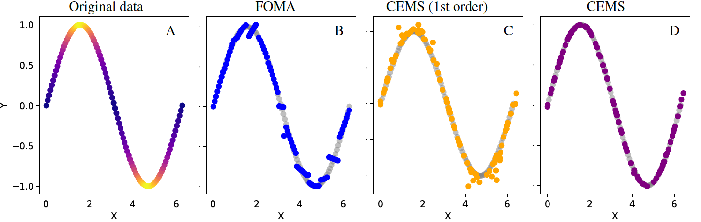

# Curvature Enhanced Manifold Sampling (CEMS)
**Official PyTorch implementation of the ICML 2025 paper  
“Curvature Enhanced Data Augmentation for Regression”**  
Ilya Kaufman, Omri Azencot — Ben‑Gurion University

<p align="center">
  
  <br><em>Figure&nbsp;1 – CEMS (right) follows the sine manifold, while first‑order sampling drifts off.</em>
</p>

[](LICENSE)
[](#)

---

## 📑 Overview
CEMS is a **second‑order, curvature‑aware data‑augmentation method for regression models**.  
Instead of mixing samples in raw Euclidean space (Mixup) or first‑order tangent space (FOMA), we locally fit a quadratic map to the data manifold and **sample directly on that surface**.

---

## Repository layout
This repo keeps the folder structure of **[C‑Mixup](https://github.com/huaxiuyao/C-Mixup)**:

```
CEMS/
├── src/
│   ├── cems.py            # main second‑order sampler
│   ├── algorithm.py       # training loop (calls get_batch_cems)
│   ├── data_generate.py   # data splits & loaders
│   └── ...
├── datasets/              # regression datasets used in the paper
├── experiments/           # CLI / config files
├── figures/               # ← put soma.png and any other figures here
├── requirements.txt       # exact package versions
└── README.md
```

### Key file – `src/cems.py`
Call `get_batch_cems(batch_x, batch_y)` just after loading each minibatch.  
Internally it:

1. Builds a *k*‑NN neighbourhood in concatenated input‑output space.  
2. Estimates tangent & normal bases via SVD.  
3. Solves a small linear system to recover gradient & Hessian coefficients (Eq. 6 in the paper).  
4. Draws a random tangent vector and maps it through the quadratic model to produce an on‑manifold sample.

---

## 🔧 Installation
```bash
git clone https://github.com/<your‑username>/CEMS.git
cd CEMS

conda create -n cems python=3.9.3 -y
conda activate cems

pip install -r requirements.txt
```
`requirements.txt` is the exact environment used for the ICML submission.

---

## 🚀 Quick start
```bash
python src/main.py   --dataset NO2  --lr 0.001 --num_epochs 100 --batch_size 32 --cems_method 1 --input_sampling 1 --sigma 0.2
```

---

## 📜 Citation
```bibtex
@inproceedings{kaufman2025cems,
  title     = {Curvature Enhanced Data Augmentation for Regression},
  author    = {Kaufman, Ilya and Azencot, Omri},
  booktitle = {Proceedings of the 42nd International Conference on Machine Learning},
  year      = {2025},
  url       = {https://github.com/<your‑username>/CEMS}
}
```

---

## 🤝 Acknowledgements
Dataset loaders and training‑script scaffolding are adapted from **C‑Mixup** (NeurIPS 2022).  
We thank Hua Yao *et al.* for releasing their work under MIT.

